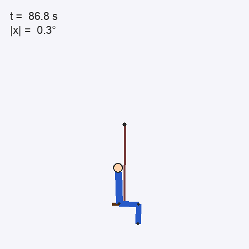
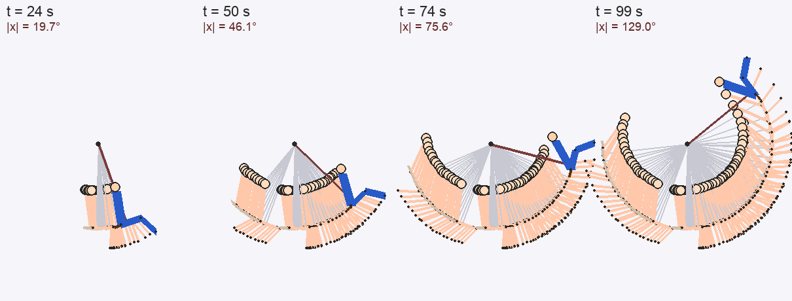
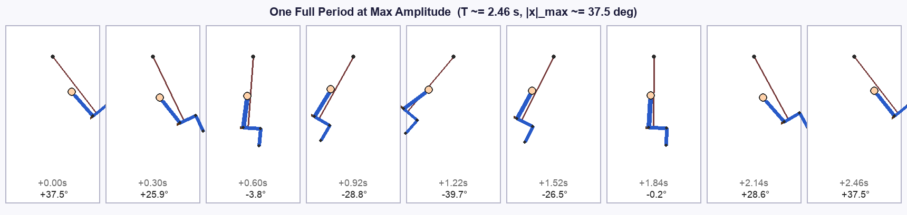
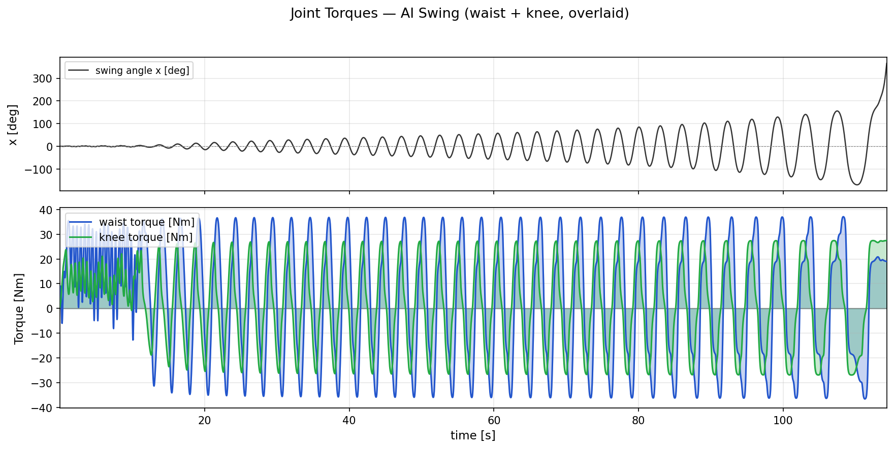

# AI Swing — 強化学習でブランコを漕ぐ (膝関節モデル)

<p align="center">
  
</p>

*▲ 最大振幅 (±90°, 水平超え) 付近の 3 周期分を等速ループ表示。ゴースト残像で振り子の弧が見えます。*



*▲ 各スナップショットには直前数秒分の履歴をゴースト重畳表示。スイングの弧が段階的に広がっていく様子がわかります。*



*▲ 最大振幅到達時の 1 周期を 9 コマに等間隔サンプル。脚の伸展・屈曲によるパラメトリック励振が見て取れます。*

https://github.com/NobutakaShimada/ai-swing/raw/main/rotation_swing.mp4

*▲ 完全静止から 114 秒で 360° 回転を達成するまでの全過程 (2 倍速動画)。*

PPO (Proximal Policy Optimization) で学習したエージェントが、**完全静止状態からブランコを漕ぎ出し、114 秒で 360° 一回転**するまでの実装です。

身体モデルは「ブランコの座面に座る人間」を 3 自由度 (ブランコ棒 $x$, 胴体 $\phi$, 下腿 $\psi$) の連結剛体としてモデル化しており、エージェントは **腰トルクと膝トルクの 2 入力** で身体を動かします。

## 成果サマリ

### 膝関節モデル (現行, `body-leg` ブランチ)

| 条件 | 結果 | 到達時間 |
|---|---|---|
| 完全静止スタート | **360° 一回転** | **114 s** |
| 完全静止スタート | ±45° 通過 | ~40 s |
| 完全静止スタート | ±90° 通過 | ~65 s |

- 行動空間: 腰トルク + 膝トルク (各 ±500 Nm)
- 膝の伸展・屈曲による**パラメトリック励振**が極めて有効

### 腰のみモデル (旧, `cold-start` ブランチ)

| 条件 | 最大振幅 \|x\| | 到達時間 |
|---|---|---|
| 完全静止スタート | **~40°** | ~260 s でプラトー |

- 行動空間: 腰トルクのみ (±500 Nm)
- 頭部は胴体に剛結合 (首関節ロック)

### 性能比較

膝関節の追加により、**到達速度が約 6 倍に向上**しました:

- 腰のみ: 260 秒かけて ±40° に到達 → そこでプラトー
- 膝あり: 40 秒で ±45° を通過 → 114 秒で **360° 一回転**

人間のブランコ漕ぎでも、前方スイング時に脚を前に伸ばし、後方スイング時に脚を畳むことで振子の有効長を周期的に変化させる**パラメトリック励振**が主要なエネルギー注入メカニズムであることが知られています。AI は報酬関数と物理モデルだけから、この戦略を自力で発見しました。

---

## 学習過程の観察

### 膝関節モデル — 静止から 360° 回転まで

| t [s] | max\|x\| [deg] | 備考 |
|---:|---:|---|
| 10 | 3.2 | 微小な種火作り |
| 20 | 14.4 | |
| 30 | 25.4 | |
| 40 | 35.8 | 腰のみモデルの最終到達値に匹敵 |
| 50 | 46.1 | |
| 60 | 56.1 | |
| 80 | 84.0 | 水平を超える |
| 100 | 129.0 | 頂上付近 |
| 114 | 360° | **一回転達成** |

### 腰のみモデル — 静止から 600 秒

| t [s] | max\|x\| [deg] |
|---:|---:|
| 30 | 2.95 |
| 60 | 5.96 |
| 100 | 16.63 |
| 150 | 28.91 |
| 200 | 35.68 |
| 260 | ~40 |
| 600 | 41.81 |

### 関節トルクの時系列



*▲ 上段: スイング角 x の時系列。下段: 腰トルク (青) と膝トルク (緑) の重ね表示。両者の位相がわずかにずれており、腰が前後方向の体重移動を担い、膝がやや遅れて脚の伸展・屈曲でパラメトリック励振を行う分業が読み取れます。*

---

## 物理モデル

3 自由度 $(x, \phi, \psi)$ の結合系:

- $x$: ブランコ棒の鉛直からの角度 (上腿はロープと剛結合)
- $\phi$: 胴体の角度 (頭部質量を統合, 座面から上方に伸びる)
- $\psi$: 下腿の角度 (膝関節で接続, 膝から下方に伸びる)

質量分布は体重 50 kg/身長 1.58 m の人体セグメント比率で組み立てています:

| セグメント | 質量比 | 長さ比 |
|---|---|---|
| 上半身 (胴体+頭部) | 62.6% | 50.1% |
| 上腿 (ロープ剛結合) | 24.6% | 24.9% |
| 下腿 (膝で接続) | 12.8% | 25.0% |

### 質量行列と連立方程式

慣性行列 $\mathbf{M}\ddot{q} = \mathbf{f}$ の 3×3 連立をクラメルの公式で直接解きます:

- $A$: ブランコ+上半身+下腿の実効慣性
- $B$: 上半身の腰まわり慣性
- $C$: 下腿の膝まわり慣性
- $D$: ロープ-胴体結合 (負符号: 胴体は上向き)
- $E$: ロープ-下腿結合 (正符号: 下腿は下向き=ロープと同方向)
- $F = 0$: 胴体-下腿の直接結合なし

### 関節のバネ・ダンパ

```python
# 腰関節
k_waist = 144.0  # [Nm/rad] — 倒立不安定 (~113) を上回る剛性
c_waist = 10.0   # [Nm·s/rad]

# 膝関節
k_knee  = 50.0   # [Nm/rad]
c_knee  = 5.0    # [Nm·s/rad]
```

腰の剛性 144 Nm/rad は、胴体の倒立不安定化トルク (~113 Nm/rad) を上回る値に設定し、エージェントがバランス維持にトルク予算を消費しなくて済むようにしています。

---

## 強化学習の定式化

### 行動空間
```python
action_space = Box(low=-500.0, high=500.0, shape=(2,))  # [腰トルク, 膝トルク] [Nm]
```

### 観測空間
```python
obs = [phi, d_phi, psi, d_psi, x, z]   # 6 次元
```

### 報酬
```python
h = 1.0 - math.cos(self.sw.x)     # ブランコの「持ち上がり高さ」(無次元)
reward = h * h * 1000.0
```
振幅の 2 乗で効くので、大振幅ほど比例以上に報酬が伸びる。

### 終了判定
```python
terminated = (|x| > 2π)                      # 1 回転 (360°)
          or (|phi - x| > 60°)               # 胴体が座面に対して倒れすぎ
          or (|psi - x| > 90°)               # 下腿がロープに対して開きすぎ (膝は広めに許容)
truncated  = (t > 200 s)
```

### 初期条件 (バイアス付きランダム)
```python
if random.random() < 0.4:
    scale = 0.0                              # 40%: 完全静止スタート
else:
    scale = random.uniform(0.0, 1.0)         # 60%: 振幅 0~15° の範囲でランダム
```

### PPO ハイパーパラメータ
```python
PPO("MlpPolicy", env, learning_rate=3e-4, ent_coef=0.01)
model.learn(total_timesteps=3_000_000)
```

物理タイムステップ: 1 ms, AI 判断周期: 20 ms

---

## 学習に至るまでに工夫した点

### 1. 報酬設計の変遷

| 世代 | 報酬 | 問題 | 対策 |
|---|---|---|---|
| v1 | **エネルギー増分** `(E_new - E_old) * 60` | step ごとにノイジーで学習が進まない | 累積的な振幅指標に変える |
| v2 | **振幅の関数** `(1 - cos(x))` | 第 2 モードで報酬ハッキング | 2 乗にしてピーク差を強調 |
| v3 (採用) | **2 乗化** `(1 - cos(x))^2 * 1000` | — | 大振幅ほど指数的に報酬が伸びる |

### 2. トルクのローパスフィルター

```python
# 1次 IIR: 時定数 tau_u = 0.1 s (カットオフ ~1.6 Hz)
alpha_f = h / self.tau_u
self.u_body_filt += (u_body - self.u_body_filt) * alpha_f
```

エージェントが 50 Hz の判断レートで高周波振動を起こす問題への対策。人間らしいゆっくりした漕ぎに矯正。

### 3. 初期条件のランダム化 (静止スタート 40%)

`x_init = -15°` 固定で訓練すると、静止からは漕ぎ出せないエージェントが得られた。40% の確率で完全静止スタートを混ぜることで、「種火を作る」局面を十分に経験させた。

### 4. 探索強化 (`ent_coef = 0.01`)

PPO のエントロピーボーナスをデフォルト 0 → 0.01 に上げ、±15° の局所最適から脱出させた。

### 5. 頭部 → 膝関節への自由度変更

当初は頭部を独立自由度として首の振り込みで漕ぐことを試みたが、学習序盤で頭部が 60° 以上倒れてエピソードが即終了する問題があった。頭部を胴体に統合し、代わりに膝関節 (下腿) を新たな自由度として導入したところ、**性能が劇的に向上**:

- 膝の伸展・屈曲で振子の有効長が変わるパラメトリック励振が極めて強力
- 腰のみでは到達できなかった大振幅域 (90° 超) にも容易に到達
- 最終的に 360° 一回転まで達成

---

## ファイル構成

### 物理モデル
| ファイル | 内容 |
|---|---|
| `swing_physics.py` | `Swing` クラス。3 自由度 (ブランコ, 胴体, 下腿) の Lagrangian から導いた結合 ODE を RK4 で時間積分。トルクは 1 次ローパスフィルター経由。 |
| `swing_env.py` | Gymnasium 環境 `SwingEnv`。2D 行動空間 (腰+膝トルク)・観測空間・報酬・終了判定を定義。 |

### 学習・可視化スクリプト
| ファイル | 内容 |
|---|---|
| `train.py` | PPO の学習 → モデル保存 → テスト走行 (3 エピソード) CSV 記録。 |
| `test_rotation.py` | 完全静止スタートで 360° 回転を記録するテスト走行。 |
| `epi_anim.py` | CSV を pygame で太線描画するインタラクティブビューワ。 |
| `render_rotation_video.py` | オフスクリーン描画 → ffmpeg で mp4 動画生成。 |
| `gph_torq.py` | トルク・角度の時系列グラフ (matplotlib)。 |

### 成果物
| ファイル | 内容 |
|---|---|
| `ai_swing_model.zip` | 学習済み PPO モデル (3M timesteps) |
| `ai_swing_rotation.csv` | 完全静止 → 360° 回転のログ |
| `rotation_swing.mp4` | 静止から一回転までの 2 倍速動画 |
| `ai_swing_result.csv` | テスト走行ログ (3 エピソード) |

### セットアップ

Python 3.9 以上が必要です。

```bash
git clone https://github.com/NobutakaShimada/ai-swing.git
cd ai-swing
python -m venv venv
source venv/bin/activate    # Windows: venv\Scripts\activate
pip install -r requirements.txt
```

主な依存パッケージ:

| パッケージ | 用途 |
|---|---|
| `gymnasium` | 強化学習環境のインターフェース |
| `stable-baselines3` | PPO アルゴリズムの実装 |
| `torch` (PyTorch) | stable-baselines3 のバックエンド |
| `numpy` / `pandas` | 数値計算・データ処理 |
| `pygame` | アニメーション描画 |
| `matplotlib` | グラフ描画 |
| `Pillow` | 画像生成 (GIF/PNG) |

動画生成には別途 `ffmpeg` が必要です:
```bash
# macOS
brew install ffmpeg
# Ubuntu/Debian
sudo apt install ffmpeg
```

### 使い方

```bash
# 学習 (30~60分)
python train.py

# 360°回転テスト走行
python test_rotation.py

# アニメーション表示 (インタラクティブ)
python epi_anim.py ai_swing_result.csv

# 動画生成
python render_rotation_video.py
```

---

## ブランチ構成

| ブランチ | 内容 |
|---|---|
| `main` | 膝関節モデル (最新, 360° 回転達成) |
| `body-leg` | 膝関節モデルの開発ブランチ |
| `cold-start` | 腰のみモデル (静止スタート → ±40°) |
| `head-segment` | 頭部独立自由度の実験ブランチ |
| `original` | 初期実装 |
